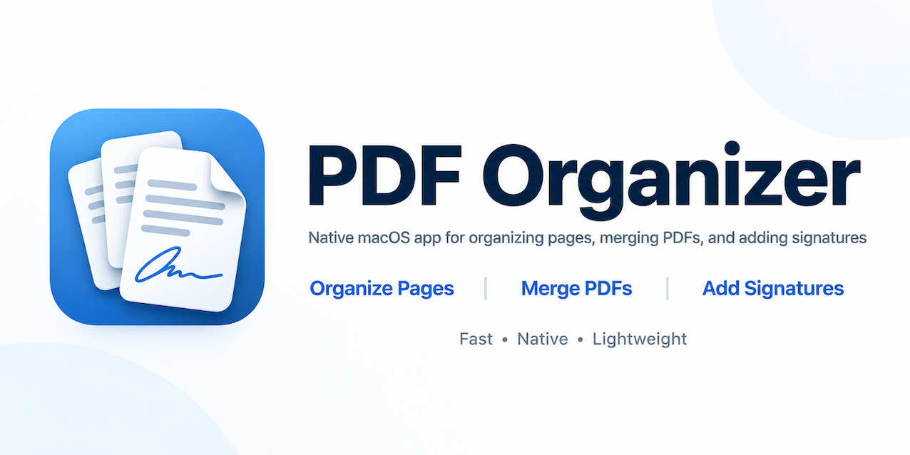

<p align="center">
  
</p>

# PDFolio

A lightweight, native macOS PDF utility for the everyday parts of Acrobat: **organize pages**, **combine PDFs**, and **add a handwritten signature**. Fast, local-only, and comfortable on a trackpad.

**Import PDFs → Organize Pages → Merge → Add Signature → Export PDF**

Your source files are never modified. Everything happens on a page list that points into them, and the result is written only when you export.

## Features

### Organize and merge
- Drop any number of PDFs or images (PNG, JPEG, HEIC, …) into the window, the sidebar, or a gap between pages
- All pages appear in one thumbnail grid. Each page is tagged with its file's color, so pages stay identifiable after mixing
- Multi-select (click, ⇧/⌘-click, rubber band), then drag to reorder, including across files
- **File-level ordering**: drag files in the sidebar to regroup their pages as whole blocks; click a file to select its pages
- Rotate, delete, duplicate
- Insert a PDF or image after the selection (⇧⌘I)
- Extract the selected pages into a new PDF (⇧⌘E)
- Unlimited undo / redo for every page operation
- Password-protected PDFs prompt for their password

### Signatures
- Draw a signature with the mouse, or use **trackpad mode**: the trackpad surface maps onto the canvas and you sign with one finger, no clicking (like Preview). Press any key when done.
- Import a signature image. Transparent PNGs are used as-is. Photos or scans of ink on paper get the white background removed and margins trimmed automatically.
- Saved signatures live in `~/Library/Application Support/PDFolio/Signatures` and never leave the Mac
- Place a signature, then drag to move, drag a corner to resize (aspect locked) and use the arrow keys to nudge. Pinch to zoom the page.
- Signatures are attached to the page content, so rotating a signed page carries the signature with it

### Export
- Exports the current page sequence as one PDF (⌘E). Page content, fonts, text and images are copied as-is: vector stays vector and nothing is rasterized. Page sizes are preserved.
- By default, signatures are embedded as stamp annotations with a real appearance stream, so they show in every PDF reader
- **Flatten** option: bakes signatures and any existing annotations into the page content so they can't be moved or deleted. Links and form fields become static.
- Exports run in the background with progress and Cancel. They write to a temporary file first, so a failed or cancelled export never leaves a broken file. Exporting over one of the imported source files is refused.

## Trackpad and keyboard

| Gesture / key | Action |
|---|---|
| Two-finger scroll | Scroll the page grid or the page being signed |
| Pinch | Resize thumbnails; zoom the page in the signing view |
| Double-click or Return | Open the page for signing |
| ⌘L / ⌘R | Rotate left / right |
| ⌘D | Duplicate |
| ⌫ | Delete selected pages (or the selected signature in the signing view) |
| ⌘Z / ⇧⌘Z | Undo / redo |
| ⌘+ / ⌘− | Larger / smaller thumbnails |

Gestures are kept to the standard macOS ones; every action is also in the toolbar and menus. If you use [TrackTab](https://github.com/yongkang-yang/TrackTab), its three-finger swipe left/right sends ⌘Z / ⇧⌘Z, which drives PDFolio's undo and redo directly.

## Requirements

- macOS 14 or later
- Xcode Command Line Tools (`xcode-select --install`). Full Xcode is not required.

## Build

```bash
./build_app.sh
open PDFolio.app
```

This makes a release build, packages `PDFolio.app` with the icon and PDF/image document types (so Finder's **Open With** works), and ad-hoc signs it. Move it to `/Applications` to keep it.

You can also pass files on launch: `PDFolio.app/Contents/MacOS/PDFolio a.pdf b.pdf`.

## Checks

XCTest isn't usable with Command Line Tools alone, so the core logic is verified by a plain executable:

```bash
swift run -c release pdfolio-checks                       # all checks + 1000-page perf case
swift run -c release pdfolio-checks --skip-perf           # logic only
swift run -c release pdfolio-checks --perf-file big.pdf   # benchmark a real file
```

It covers page-list operations (move, remove, duplicate, rotate, file regrouping, insert), rotation geometry, and export in both modes. For export it renders the output and checks, by pixels, that each signature lands in the right place and orientation, including on pre-rotated pages and pages rotated after signing. It also checks text preservation, page sizes, source-file protection, cancellation and cleanup, image import, and signature cleanup.

Two launch arguments help check the UI end to end:

- `--scroll-benchmark --quit <files…>`: scrolls the whole grid down and back up, prints peak memory, then quits
- `--snapshot <dir> <files…>`: renders the main window, the signing sheet and the signature pad to PNGs. This works without Screen Recording permission.

## Performance

Performance is an MVP requirement, and the design follows from it:

- The workspace stores **page references** (source, page index, rotation, signatures), never page images
- Thumbnails render lazily on a background queue, only for cells on screen. Requests for cells that scroll away are dropped before rendering.
- Thumbnail sizes snap to a few buckets, and images live in an `NSCache` with a 48 MB budget. Rotation is a layer transform, so it never re-renders.
- The signing view draws the page as vector content on demand. There is no full-page bitmap.
- Export streams page by page. The flattened path writes through a `CGPDFContext` directly to disk.
- Under memory pressure, all caches and parsed documents are dropped. They're recreated on demand.

Measured on an Apple Silicon Mac (MacBook, 2560×1664 Retina) with generated pages that each contain a JPEG photo, vector art and a paragraph of text:

| Scenario | Target | Measured |
|---|---|---|
| Empty window, idle | 40–80 MB | **25 MB** |
| 20 pages from 3 files, loaded | 70–150 MB | **52 MB** |
| 1000 pages, scroll top → bottom → top | < 500–700 MB | **peak 185 MB** |
| 3000 pages, same scroll | — | **peak 223 MB** |
| Export 1000 pages (assembled / flattened) | responsive | **0.9 s / 0.9 s**, footprint < 50 MB |

## Project layout

```
Sources/PDFolioCore     Model, page-list ops, geometry, export, thumbnail renderer (no UI)
Sources/PDFolio         AppKit app: window, grid, sidebar, signing, signature pad
Sources/PDFolioChecks   Check runner and benchmarks
Resources               App icon
```

## Not in scope (for now)

Text/content editing, OCR, a full annotation suite, forms, cloud sync, AI features, and certificate-based digital signatures. The signature here is a visual handwritten signature, not a cryptographic one.

## Known limitations

- Bookmarks/outlines from source PDFs are not carried into the exported file
- Flattening makes links and form fields non-interactive (that's what flattening means). The default export keeps them.

## License

PDFolio is licensed under the [GNU General Public License v3.0](LICENSE).
